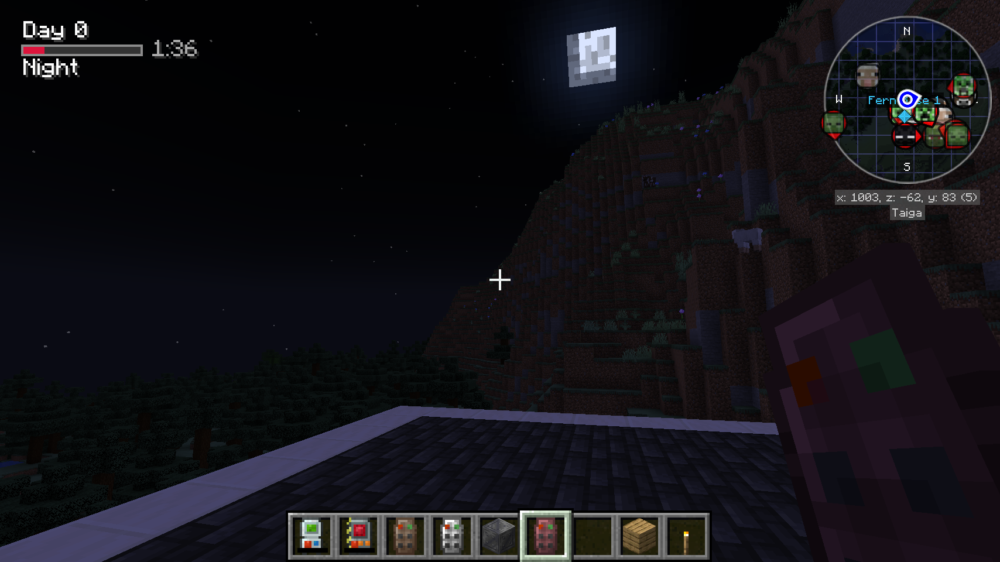

# Time Status

Mod based on https://minecraft.fandom.com/wiki/Daylight_cycle

## Features

- Shows progress bars during time periods, day, sunset, night and sunrise

# Screenshots

## Configuration

In config/timestatus-common.toml you can change the following items to hide/show items

## Keyboard shortcut

Default shortcut is H

## TODO

- configs
    - position
    - custom colots
    - warnings before a period